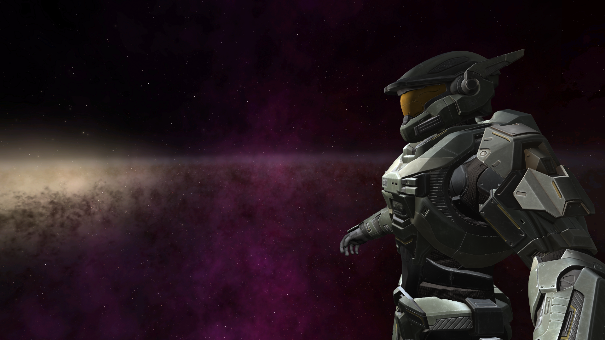
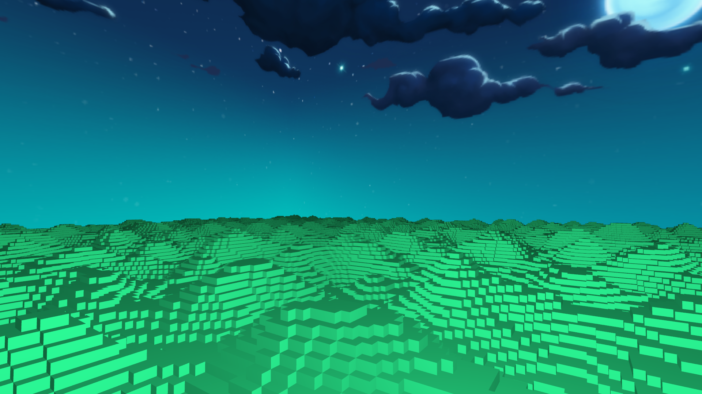

# Extra Life 3D Engine
Entity Component System Game Engine (In Progress)





## Features
- Blinn Phong Lighting
- Normal Mapping
- Model Loading
- Voxels
  - Infinite Terrain 
  - Greedy Meshing 
- Custom Framebuffer System
- Gamma Correction
## Dependencies
```
.\vcpkg install glfw3
.\vcpkg install assimp:x64-windows
.\vcpkg install entt:x64-windows
.\vcpkg install glm:x64-windows
.\vcpkg install stb:x64-windows
.\vcpkg install libnoise:x64-windows
```
## Other
- C++ 17 64 bit
- Included External Resources 
  - Glad OpenGL Core 4.6 Files : https://glad.dav1d.de/
  - ExternalResources/c/glad.c
  - ExternalResources/include/glad
  - ExternalResources/include/khr
  - ExternalResources/include/imgui
  - ExternalResources/include/StringUtilities
    - https://github.com/paulburgess1357/String-Utilities
- 3D Models
  - 3D models are **not** included.  A variety of formats will work.  If unsure, defaulting to gltf is a safe bet.
    - model_folder
      - textures
      - scene.bin
      - scene.gltf
- Load Scene
  -  ExtraLifeEngine\Tests\GraphicsTesting\Scenes\SceneLoader.h
  -  Note: Shaders must be written in view space if using a normal matrix.
  -  Currently a conversion of shaders from world space to view space is in progress.  As such, expect lighting to be off until this is complete.  
-  Load Framebuffer
    -  ExtraLifeEngine\Environment\Neutral\FrameBuffer\FramebufferLoader.h
    -  Gamma correction is already in place via OpenGL.  If writing your own gamma correction framebuffer, set the type to: FrameBufferType::GAMMA_CORRECTION.  If a gamma correction framebuffer is loaded, it will automatically be last in the order of framebuffer execution, even if you add more framebuffers.  Loading a gamma correction framebuffer will disable the OpenGL gamma correction implementation.
    -  See FrameBufferLoader::load_gamma_correction() for an example.
