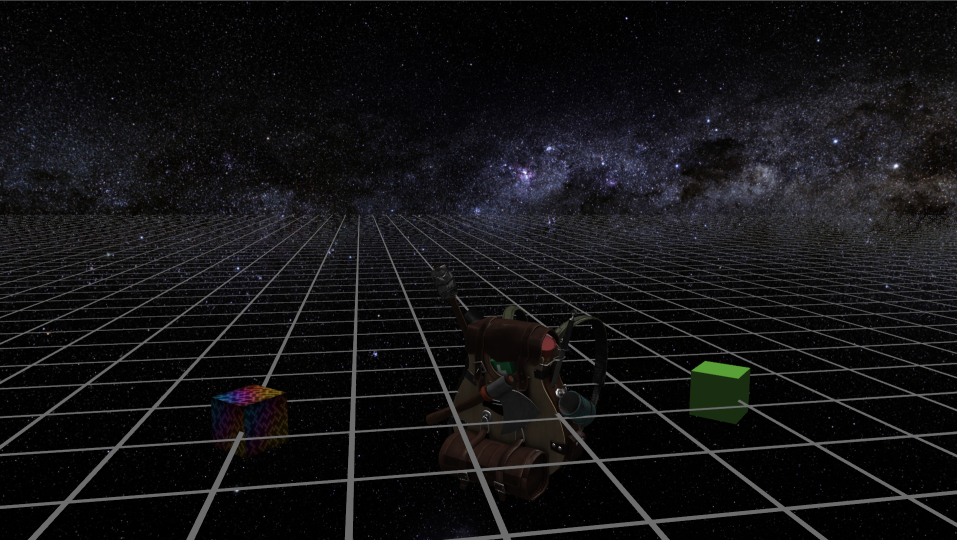
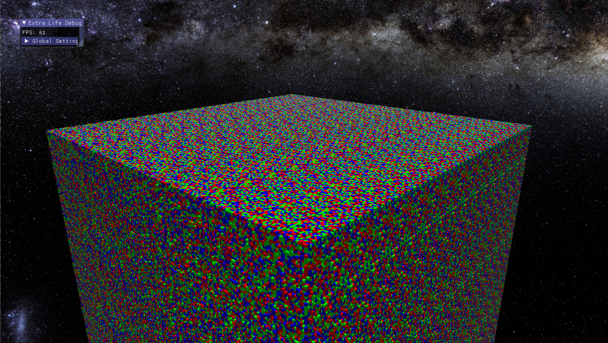

# Extra Life 3D Engine
Entity Component System Game Engine (In Progress)

## Features
- Blinn Phong Lighting
- Normal Mapping
- Flexible Architecture
  - Modern OpenGL 3.3+
  - Future Vulkan Support
- Voxels
  - Greedy Meshing 
## Dependencies (Included in repo)
- OpenGL
- Assimp
- GLFW
- STB Image
- GLM
- Entt
## Other
- C++ 17

